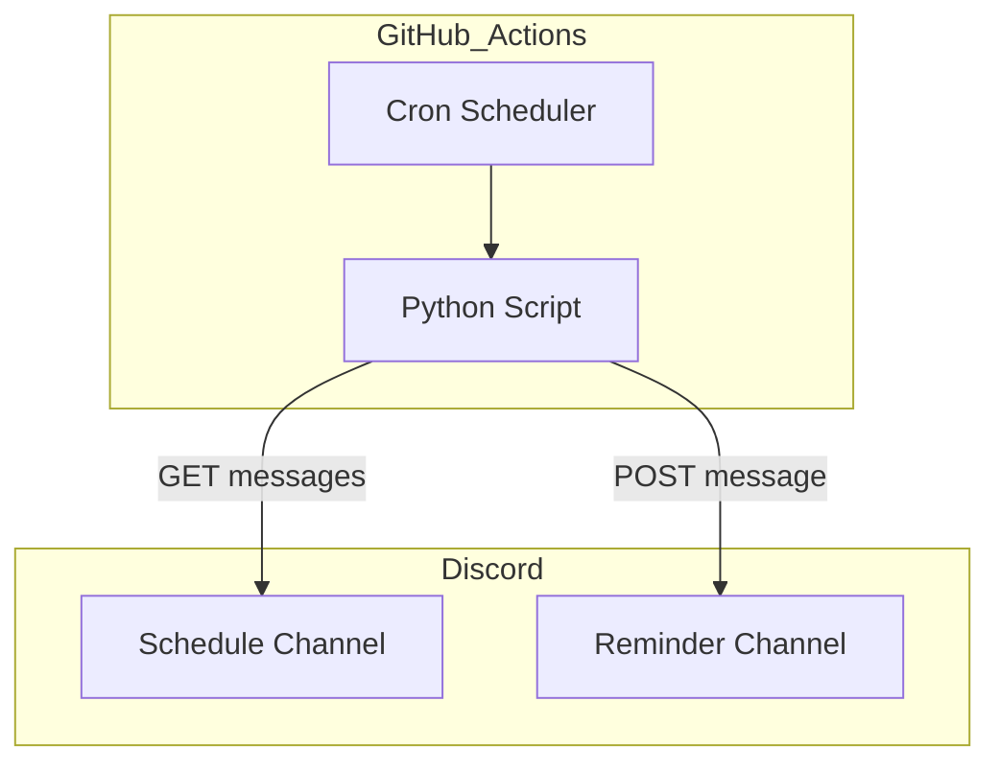
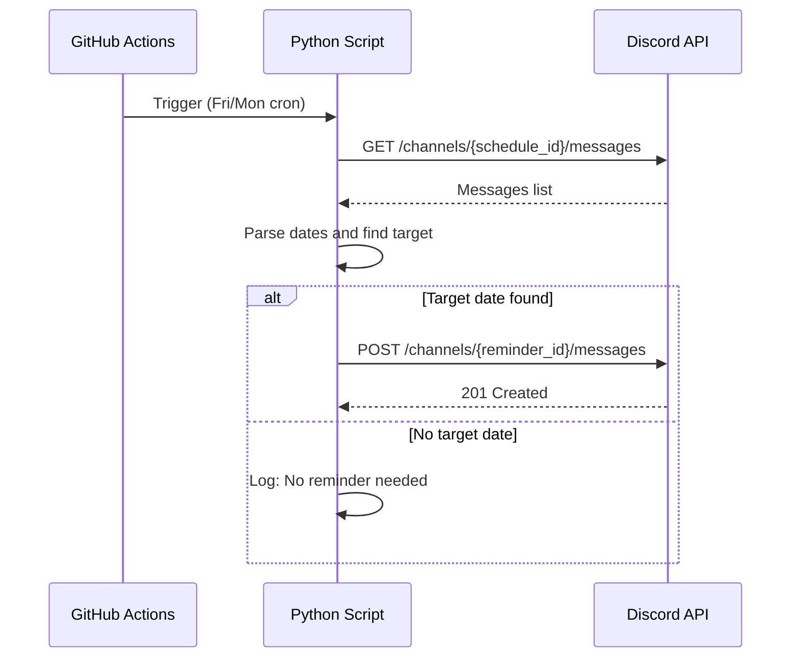
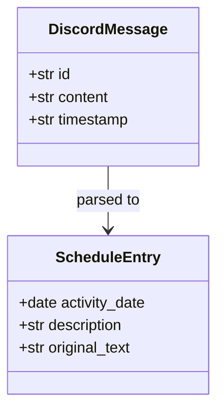

# Design Document

## Overview

**Purpose**: 部活動のスケジュール管理を自動化し、Discordの予定チャンネルから活動日を読み取り、適切なタイミングでリマインド通知を送信する。

**Users**: 部活動のメンバーが対象。活動準備（土日）と最終確認（月曜）のリマインドを受け取る。

**Impact**: 手動リマインドの手間を削減し、活動日の忘れ防止に貢献する。

### Goals
- 予定チャンネルから `M/D 活動内容` 形式のメッセージを自動解析
- 前週金曜日と当週月曜日の2回、適切なタイミングでリマインド送信
- GitHub Actionsによる完全自動化（サーバーレス運用）

### Non-Goals
- リアルタイム通知（Gateway接続が必要なため対象外）
- 複数サーバー対応（単一部活向け）
- 予定の編集・削除機能

## Architecture

### Architecture Pattern & Boundary Map



**Architecture Integration**:
- Selected pattern: Serverless Script Architecture — GitHub Actionsのcronで定期実行するシンプルなスクリプト構成
- Domain boundaries: スケジュール読み取り / 日付判定 / リマインド送信の3責務に分離
- New components rationale: 外部サービス（Discord API）との連携のみ、永続化不要

### Technology Stack

| Layer | Choice / Version | Role in Feature | Notes |
|-------|------------------|-----------------|-------|
| Runtime | Python 3.11+ | スクリプト実行 | GitHub Actionsデフォルト対応 |
| HTTP Client | requests 2.31+ | Discord API呼び出し | 軽量、標準的 |
| Scheduler | GitHub Actions cron | 週次定期実行 | 金曜・月曜に実行 |
| Secret Management | GitHub Secrets | Token/ID管理 | DISCORD_TOKEN, CHANNEL_IDs |

## System Flows

### Main Flow: Weekly Reminder



**Key Decisions**:
- 金曜日実行時は次週水曜日（5日後）をターゲット
- 月曜日実行時は今週水曜日（2日後）をターゲット
- 該当予定がなければ何も送信しない
- 予定チャンネルの全メッセージをスキャンし、`M/D 活動内容` 形式のすべてを解析
- 複数の予定がある場合は、最も近い未来の予定（今日以降）を1件選択してリマインド

## Requirements Traceability

| Requirement | Summary | Components | Interfaces | Flows |
|-------------|---------|------------|------------|-------|
| 1.1 | 予定チャンネルからメッセージ取得 | DiscordClient | get_messages() | Main Flow |
| 1.2 | 日付と活動内容を抽出 | ScheduleParser | parse_schedule() | Main Flow |
| 1.3 | 当週水曜日の予定を特定 | DateCalculator | get_target_date() | Main Flow |
| 2.1 | 前週金曜日にリマインド送信 | ReminderSender | send_reminder() | Main Flow |
| 2.2 | 当週月曜日にリマインド送信 | ReminderSender | send_reminder() | Main Flow |
| 2.3 | 重要連絡チャンネルに送信 | DiscordClient | post_message() | Main Flow |
| 2.4 | 活動日と内容を含むメッセージ | MessageFormatter | format_reminder() | Main Flow |
| 3.1 | GitHub Actionsで定期実行 | GitHub Actions Workflow | cron trigger | - |
| 3.2 | 予定がない場合は送信しない | Main Script | conditional logic | Main Flow |

## Components and Interfaces

| Component | Domain/Layer | Intent | Req Coverage | Key Dependencies | Contracts |
|-----------|--------------|--------|--------------|------------------|-----------|
| DiscordClient | Infrastructure | Discord API通信 | 1.1, 2.3 | requests (P0) | Service |
| ScheduleParser | Domain | メッセージ解析 | 1.2 | re (P0) | Service |
| DateCalculator | Domain | 日付計算 | 1.3, 2.1, 2.2 | datetime (P0) | Service |
| MessageFormatter | Domain | メッセージ整形 | 2.4 | - | Service |
| ReminderSender | Application | リマインド送信制御 | 2.1, 2.2, 3.2 | DiscordClient (P0), ScheduleParser (P1), DateCalculator (P1) | Service |

### Infrastructure Layer

#### DiscordClient

| Field | Detail |
|-------|--------|
| Intent | Discord REST APIとのHTTP通信を担当 |
| Requirements | 1.1, 2.3 |

**Responsibilities & Constraints**
- チャンネルメッセージの取得とメッセージ送信のみ
- Bot Tokenを使用した認証
- レート制限への対応（リトライは実装しない、エラーログのみ）

**Dependencies**
- External: requests — HTTP通信 (P0)
- External: Discord REST API — メッセージ取得・送信 (P0)

**Contracts**: Service [x]

##### Service Interface
```python
from dataclasses import dataclass
from typing import Optional

@dataclass
class DiscordMessage:
    id: str
    content: str
    timestamp: str

class DiscordClient:
    def __init__(self, token: str) -> None: ...

    def get_messages(
        self,
        channel_id: str,
        limit: int = 50
    ) -> list[DiscordMessage]:
        """
        チャンネルから最新メッセージを取得する。

        Raises:
            DiscordAPIError: API呼び出し失敗時
        """
        ...

    def post_message(
        self,
        channel_id: str,
        content: str
    ) -> bool:
        """
        チャンネルにメッセージを送信する。

        Returns:
            成功時True、失敗時False
        """
        ...
```

**Implementation Notes**
- Integration: `Authorization: Bot {token}` ヘッダー形式
- Validation: channel_idは数字文字列であること
- Risks: レート制限（100req/min/route）、制限超過時はログ出力のみ

### Domain Layer

#### ScheduleParser

| Field | Detail |
|-------|--------|
| Intent | メッセージテキストから日付と活動内容を抽出 |
| Requirements | 1.2 |

**Responsibilities & Constraints**
- `M/D 活動内容` 形式のパースのみ対応
- 不正形式はスキップしてログ出力

**Dependencies**
- Inbound: ReminderSender — メッセージ解析依頼 (P1)

**Contracts**: Service [x]

##### Service Interface
```python
from dataclasses import dataclass
from datetime import date
from typing import Optional

@dataclass
class ScheduleEntry:
    activity_date: date
    description: str
    original_text: str

class ScheduleParser:
    def parse_schedule(
        self,
        message_content: str,
        reference_year: int
    ) -> Optional[ScheduleEntry]:
        """
        メッセージから予定情報を抽出する。

        Args:
            message_content: パース対象のメッセージ
            reference_year: 日付解釈の基準年

        Returns:
            解析成功時はScheduleEntry、失敗時はNone
        """
        ...
```

**Implementation Notes**
- Validation: 正規表現 `r'(\d{1,2})/(\d{1,2})\s+(.+)'` を使用
- Risks: 年をまたぐ場合の処理（12月に1月の予定など）

#### DateCalculator

| Field | Detail |
|-------|--------|
| Intent | 実行日からターゲット日付を計算 |
| Requirements | 1.3, 2.1, 2.2 |

**Responsibilities & Constraints**
- 金曜日実行: 次週水曜日（5日後）を返す
- 月曜日実行: 今週水曜日（2日後）を返す
- その他の曜日: Noneを返す（リマインド不要）

**Contracts**: Service [x]

##### Service Interface
```python
from datetime import date
from typing import Optional

class DateCalculator:
    def get_target_date(self, today: date) -> Optional[date]:
        """
        リマインド対象の活動日を計算する。

        Args:
            today: 実行日

        Returns:
            金曜日なら次週水曜日、月曜日なら今週水曜日、それ以外はNone
        """
        ...

    def is_reminder_day(self, today: date) -> bool:
        """
        今日がリマインド送信日（金曜または月曜）かを判定する。
        """
        ...
```

#### MessageFormatter

| Field | Detail |
|-------|--------|
| Intent | リマインドメッセージの整形 |
| Requirements | 2.4 |

**Contracts**: Service [x]

##### Service Interface
```python
from datetime import date

class MessageFormatter:
    def format_reminder(
        self,
        activity_date: date,
        description: str,
        mention_everyone: bool = True
    ) -> str:
        """
        リマインドメッセージを整形する。

        Args:
            activity_date: 活動日
            description: 活動内容
            mention_everyone: @everyoneメンションを含めるかどうか

        Returns:
            フォーマット済みメッセージ文字列
        """
        ...
```

**Implementation Notes**
- 出力例（mention_everyone=True の場合）:
  ```
  @everyone
  📅 今週の活動予定
  日付: 3/20（水）
  内容: 練習試合

  準備をお願いします！
  ```

### Application Layer

#### ReminderSender

| Field | Detail |
|-------|--------|
| Intent | リマインド送信のオーケストレーション |
| Requirements | 2.1, 2.2, 3.2 |

**Responsibilities & Constraints**
- 予定取得 → 日付判定 → メッセージ整形 → 送信の一連フロー制御
- 該当予定がなければ送信をスキップ

**Dependencies**
- Outbound: DiscordClient — メッセージ取得・送信 (P0)
- Outbound: ScheduleParser — 予定解析 (P1)
- Outbound: DateCalculator — 日付計算 (P1)
- Outbound: MessageFormatter — メッセージ整形 (P2)

**Contracts**: Service [x]

##### Service Interface
```python
class ReminderSender:
    def __init__(
        self,
        discord_client: DiscordClient,
        schedule_channel_id: str,
        reminder_channel_id: str
    ) -> None: ...

    def run(self) -> bool:
        """
        リマインド処理を実行する。

        Returns:
            リマインド送信成功時True、送信不要または失敗時False
        """
        ...
```

## Data Models

### Domain Model



**Entities**:
- `DiscordMessage`: Discord APIから取得したメッセージ
- `ScheduleEntry`: パース済みの予定情報

**Business Rules**:
- 活動日は水曜日固定
- リマインドは前週金曜と当週月曜の2回

## Error Handling

### Error Strategy
単純なログ出力とスキップ戦略を採用。GitHub Actionsのログで確認可能。

### Error Categories and Responses

| Error Type | Handling | Log Level |
|------------|----------|-----------|
| Discord API接続エラー | 処理中断、エラーログ出力 | ERROR |
| レート制限超過 | 処理中断、警告ログ出力 | WARNING |
| パースエラー（不正形式） | 該当メッセージをスキップ | WARNING |
| 環境変数未設定 | 即座に終了 | ERROR |

### Monitoring
- GitHub Actionsのワークフローログで確認
- 失敗時はActionsのステータスがfailedになる

## Testing Strategy

### Unit Tests
- `ScheduleParser.parse_schedule()`: 正常形式、不正形式、境界値
- `DateCalculator.get_target_date()`: 各曜日での動作
- `MessageFormatter.format_reminder()`: 出力形式確認

### Integration Tests
- `DiscordClient`: モックサーバーへのリクエスト・レスポンス
- `ReminderSender.run()`: 全体フローのE2E

## Security Considerations

- **Token管理**: DISCORD_TOKENはGitHub Secretsで管理、コードにハードコードしない
- **Channel ID管理**: 環境変数で管理、リポジトリにコミットしない
- **Bot権限**: 必要最小限（メッセージ読み取り、メッセージ送信のみ）
